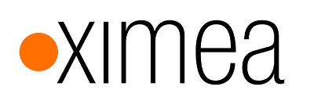

If you're interested in becoming a sponsor contact us at <a href="mailto:robot@itcollege.ee">robot@itcollege.ee</a>

For sponsors we provide visibility at annual [Robotex](http://www.robotex.ee/) robotics competition and
in the Robotics Club rooms among the bright students of [Estonian IT College](http://www.itcollege.ee/).
In January of 2016 we registered legal entity MTÜ IT Kolledži Robootikaklubi
in Estonia and we can issue invoices.
The non-profit organization was founded by 12 club members and
Lauri Võsandi is serving as board member.

We are also interested in e-junk - please give us a call on +372 628 5868
if you could offer us computer screens,
keyboards, mice, servers, embedded devices, drill benches, power supplies etc.
You can also offer shelves and other stuff that might come handy for stuff that we do.

## Academic year 2016/2017

Our sponsors for this year are <a href="http://www.helmes.ee/">Helmes</a> and <a href="http://www.proekspert.ee/">Proekspert</a>.
As usual Estonian IT College is providing us rooms 412/413 in the building at Raja 4c.


 


## Academic year 2013/2014

Our sponsor for this year was <a href="https://www.skype.com/">Skype</a>.



## Robotex 2012

Neve3 robot built with industrial cameras donated by [Ximea](https://www.ximea.com/de/exhibitions/ximea-cameras-at-robotex-2012) took 3rd place on Robotex.

Helmes sponsored our participation on [Robotex 2012](http://www.robotex.ee/)



## Robotex 2011

Helmes sponsored our participation on [Robtex 2011](http://www.robotex.ee/)


